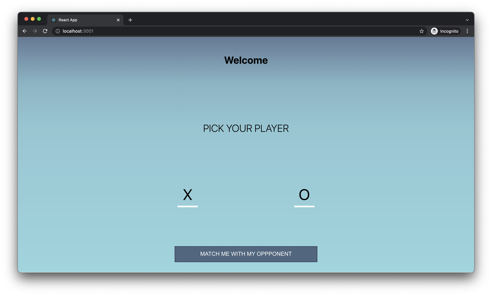

# Fairwinds Frontend Developer Assesment Task
This task was given to Victory Nwani as an assesment for a Frontend Role with Fairwinds. 

### Checklist 
This is a checklist of clipboards implemented from the given [Figma board](https://www.figma.com/file/xICKzY5CFZjXFubtKohgKx/tic-tac-toe-xo?node-id=1%3A59). 
- [x] Homescreen
- [x] Selection
- [x] Waiting to be matched
- [x] Now in game - toast
- [x] Now in game
- [x] Game screen(s)

[ ] Adding **Again** to the win status when a player wins consecutively. E.g **X Wins Again**

### Personal Development Notes

1. In `handleTileClick` function, the `tiles` state hooks is being copied into a new array to avoid directly mutating the index without using the `setTiles`. After the indexes have been updated, the copied array is set to the `tiles` state using the `setTiles` hook.

2. The `tiles` component state is initialized to `null` values. This makes it easier to check the elements within the array by checking for falsy values. 

3. For managing the major application views within a page, `if` statements are being used over ternary operators to improve code readability as ternary operators could become diffcult to mentally understand when used over a large block of code.

### Further Improvements

Although these goals were not identified in the task description, these are stretch goals that I will love to implement if I were to extend this interview application. 

- Persisting the `userGameRecord` component state in browser's local storage. 
- Introduce the React context API for better state management. 
- Adding React Error Boundaries to catch errors that might occur in the `game` page.   

